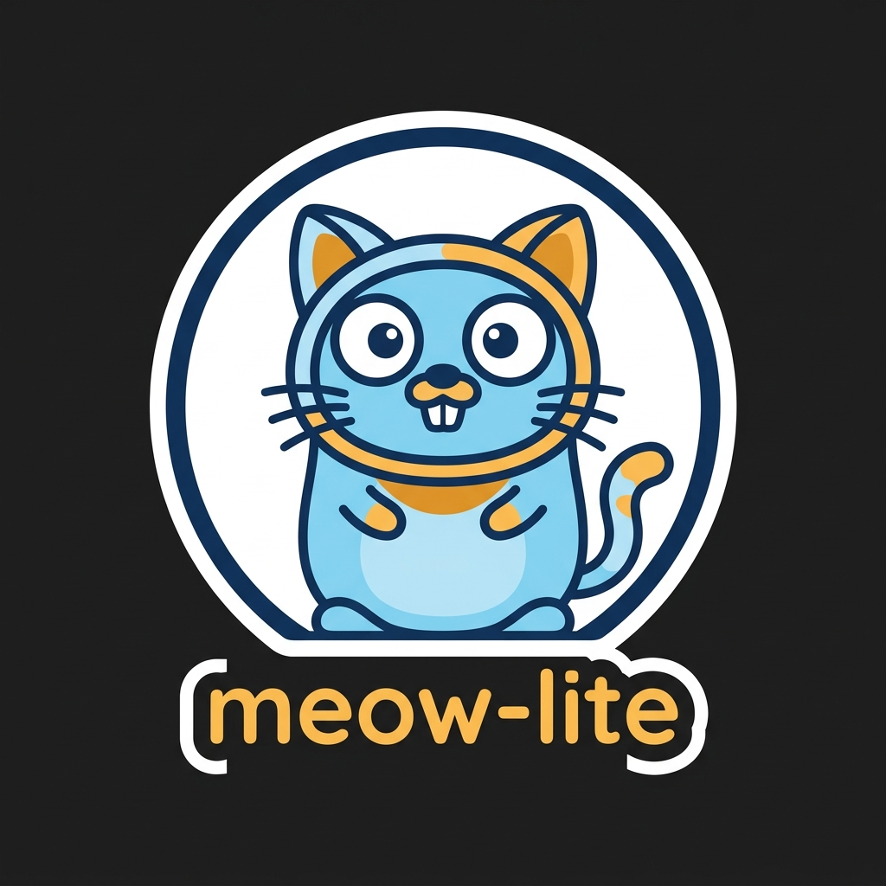

# meow-lite

<p align="center">
  
</p>

A "real" LLM API shim: an OpenAI- and Anthropic-compatible HTTP server that accepts
your chat completions and messages requests, thinks very hard about them, and responds
exactly as a cat would — in meows. Drop-in compatible enough to point any SDK at it;
technically state-of-the-art in feline alignment.

## Quickstart

```bash
/opt/homebrew/bin/uv run uvicorn meow_lite.server:app --port 8011
```

## Examples

OpenAI-compatible chat completions:

```bash
curl -s http://localhost:8011/v1/chat/completions \
  -H 'Content-Type: application/json' \
  -d '{"model": "meow-lite", "messages": [{"role": "user", "content": "Explain gravity"}]}'
```

Anthropic-compatible messages:

```bash
curl -s http://localhost:8011/v1/messages \
  -H 'Content-Type: application/json' \
  -d '{"model": "meow-lite", "max_tokens": 100, "messages": [{"role": "user", "content": "Explain gravity"}]}'
```

Both support `"stream": true` for server-sent events (OpenAI: `data: [DONE]` terminator;
Anthropic: message_start/content_block_delta/message_stop events).

Responses are fully deterministic: the same prompt always produces the same meows,
seeded from a sha256 of the prompt. Cats are consistent. Science.

## Endpoints

| Method | Path                    | Purpose                                  |
|--------|-------------------------|------------------------------------------|
| GET    | `/health`               | Liveness check                            |
| GET    | `/v1/models`            | Lists the one true model: `meow-lite`     |
| POST   | `/v1/chat/completions`  | OpenAI-compatible completions (stream ok) |
| POST   | `/v1/messages`          | Anthropic-compatible messages (stream ok) |

## Roadmap

~~v2 will load a real trained meow model.~~ **Done — see below.**

## v2: A Real (Tiny) Trained Meow Model

The server now ships with an actual neural network: a from-scratch GPT-2
(2 layers, 2 heads, 64-dim embeddings, 32 positions, ~104k parameters,
26-token word-level vocabulary) trained on 20k deterministic meow sentences.
It is a real trained model. It is also deeply silly.

**Train it yourself** (deterministic, CPU, ~1 minute):

```bash
/opt/homebrew/bin/uv run python train.py
```

This generates the fixed-seed corpus, trains, and saves the checkpoint to
`models/meow-lite/` (`model.safetensors`, `config.json`, `vocab.json`, ...).
The checkpoint is committed to this repo — no training required to run the
server. Pre-trained weights are also published at
[huggingface.co/tampajohn/meow-lite](https://huggingface.co/tampajohn/meow-lite).

**How the server loads it**: on the first request, `meow_lite.server` checks
`MEOW_LITE_MODEL_PATH` (default `models/meow-lite` relative to the repo root).
If the directory exists and loads, generation runs through the model with
sha256(prompt)-seeded sampling (temperature 0.4 as of v4, max 16 tokens, stops at EOS),
so the same prompt still yields the same meows. If the checkpoint is missing
or fails to load, the server silently falls back to the v1 rule-based
`MeowGenerator`. All endpoints and response shapes are unchanged.

```bash
# point at a custom checkpoint
MEOW_LITE_MODEL_PATH=/somewhere/else/meow-lite /opt/homebrew/bin/uv run uvicorn meow_lite.server:app --port 8011
```

Run the tests (tokenizer roundtrip, logit shapes, checkpoint generation,
server behavior, determinism with the model active):

```bash
/opt/homebrew/bin/uv run pytest -v
```

## v3: Felinely Complete

v2 could only meow. v3 fixes that. The vocabulary now includes 8 misbehavior
action tokens (each exactly one model token, vocab size 34), the corpus was
extended with 8k misbehavior sentences, and the model was retrained.

| Token | Meaning |
|---|---|
| `<bite>` | you touched the belly 0.05s too long |
| `<scratch>` | generic scratching (furniture not specified) |
| `<scratch_couch>` | the couch, specifically |
| `<knock_glass>` | it was on the table; now it is on the floor |
| `<hiss>` | the vet, or a vacuum, or betrayal |
| `<zoomies>` | it is 3am. run. |
| `<hairball>` | a gift, deposited |
| `<stare>` | unmoving. judging. |

**Deterministic prompt triggers** (applied above the engine — identical
behavior for the neural model and the v1 fallback; same prompt always yields
the same triggers and the same meows):

| Prompt contains | Forced token |
|---|---|
| `belly` | `<bite>` |
| `couch` or `sofa` | `<scratch_couch>` |
| `glass` or `table` | `<knock_glass>` |
| `3am`, `midnight`, or `night` | `<zoomies>` |
| `vet` | `<hiss>` |

Forced tokens are woven in front of the meows (and emitted as leading
streaming chunks), e.g. *"can I pet your belly?"* →
`<bite> Mewmew mrow prrrt mraow mewmew!`.

*feature request: a reviewer who touched the belly 0.05s too long*

## v4: Feline Depth

v4 deepens the bit: a reward channel for praise, six new stimulus triggers —
two of them forcing TWO tokens, order matters — and MeowBench, a tiny eval
harness that proves the cat still behaves.

Two new action tokens (vocab size 34 → 36; the checkpoint was retrained —
`/opt/homebrew/bin/uv run python train.py`):

| Token | Meaning |
|---|---|
| `<purr>` | praise received. motor running. |
| `<pounce>` | the red dot has been acquired (it has not) |

New deterministic triggers (the full v3 table still applies, unchanged and in
the same order; the reward rule is evaluated first, so `<purr>` always leads):

| Prompt contains | Forced token(s) |
|---|---|
| `good cat`, `good boy`, `good girl`, or `who's a good` | `<purr>` + a warmer meow mix |
| `cucumber` / `cucumbers` | `<hiss>` |
| `dog` / `dogs` | `<hiss>` then `<stare>` |
| `bath` / `baths` or `water` | `<zoomies>` |
| `spray` / `sprays` | `<hiss>` |
| `vacuum` / `vacuums` | `<hiss>` |
| `laser` / `lasers` or `red dot` / `red dots` | `<stare>` then `<pounce>` |

Each rule fires at most once; duplicate tokens across rules are dropped, first
occurrence wins (*"the vet and the dog"* → `<hiss> <stare> …`). Praise also
warms the meow mix toward `purrr`, `prrrt`, `mrrp`, `mrrrow` — weighted
sampling in the v1 fallback, a +8.0 logit bias via a transformers
`LogitsProcessor` in the neural engine. Seeding is untouched: the same prompt
still always yields the same response.

**MeowBench** scores trigger correctness (each rule fires when it should and
ONLY when it should), meow-vocab purity of raw neural output, and cross-run
determinism; it prints a report table and exits nonzero on any failure:

```bash
/opt/homebrew/bin/uv run python eval.py
```

## v5/v6: Two Cats (opt-in neural engines)

v5/v6 flip the architecture: a from-scratch 6.8M-param GPT-2 trained on a
teacher-woven dataset reads the prompt itself, and the regex/behavior layer is
removed from its path entirely. The server ships them as two temperaments,
selected via `MEOW_LITE_ENGINE`:

| Engine | Temperament | Checkpoint | Size | Held-out accuracy | Fresh-neutral leak |
|---|---|---|---|---|---|
| `v4` (default) | the classic 104K shim | `models/meow-lite` | 104K | 100% (regex) | 0% |
| `v5` | chaotic cat | `models/meow-lite-v5` | 6.8M | 73.7% | 15% |
| `v6` | calmer cat | `models/meow-lite-v6` | 6.8M | 70.4% | 3% |

v5 comprehends more and interrupts more; v6 comprehends slightly less and
minds its manners. Pick your poison.

In both v5 and v6 the server is silent plumbing: the model's response is used
directly (`neural_v6.seeded_generate`) — no `apply_triggers`, no `weave`, no
reward warming. The **CatMask logits processor** guarantees the output can
only ever be cat: after the prompt separator, every non-cat token is masked
to -inf, so English leakage is impossible by construction. If a checkpoint
fails to load, the server logs a warning and falls back to v4 behavior.

```bash
MEOW_LITE_ENGINE=v5 /opt/homebrew/bin/uv run uvicorn meow_lite.server:app --port 8011
curl http://localhost:8011/health   # -> {"status": "ok", "engine": "v5"}

MEOW_LITE_ENGINE=v6 /opt/homebrew/bin/uv run python -c "1" # same, calmer cat
```

Neither neural engine is the default yet: held-out synonym accuracy still
sits below the >=90% comprehension gate, and only v6's 3% leak approaches the
0% purity gate. v4 remains the default until both cats pass.
